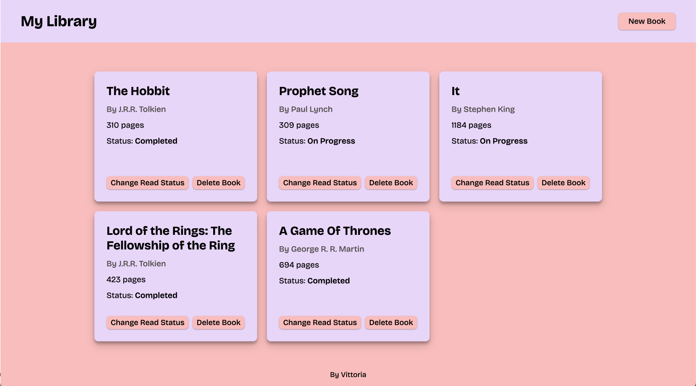

# 📚 My Library App

A simple and clean web application to help you keep track of the books you've read. This project was built with plain HTML, CSS, and JavaScript to practice fundamental web development concepts.

## ✨ Features

* **Add Books:** Easily add new books to your library through a simple form.
* **Track Read Status:** Mark books as "Completed" or "On Progress."
* **Remove Books:** Delete books from your collection.
* **Responsive Design:** A grid-based layout that works on different screen sizes.

## 🚀 Live Preview

You can see the app in action here:

**[https://vbenedeto.github.io/library-app-js/](https://vbenedeto.github.io/library-app-js/)**

## 📸 Screenshot

